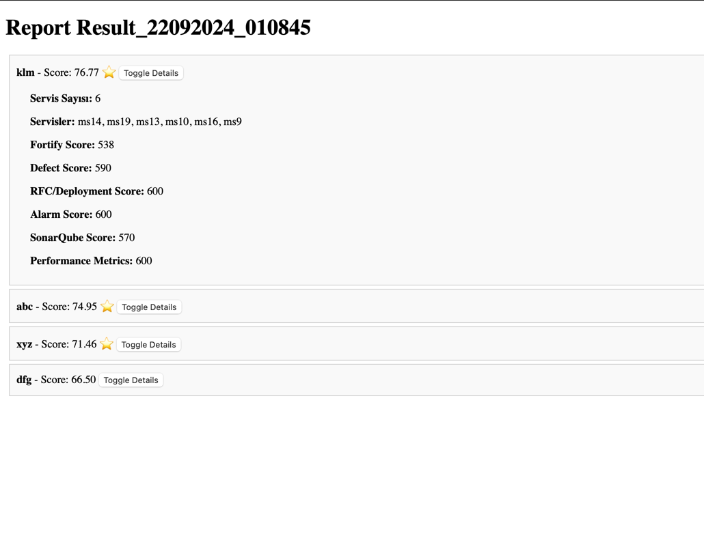

# Scoreboard

Scoreboard is an application that collects metrics from microservices owned by teams, scoring them based on criteria such as performance, security, error management, and deployment efficiency, generating reports. The application connects to a Couchbase NoSQL database to gather service data and returns the reports in JSON format. Reports can also be generated manually or automatically and visualized through a web interface.

## Project Structure

- **app.py**: Flask-based web server. Defines API routes and returns reports.
- **report_service.py**: Module that analyzes service metrics and generates reports.
- **couchbase_connection.py**: Manages Couchbase database connections.
- **metrics_calculations.py**: Contains score calculations for metrics such as Fortify, SonarQube, and performance metrics.
- **config_loader.py**: Loads the project's configuration file.

## Features

1. **Report Generation**: Scores are calculated based on collected service metrics and saved to Couchbase.
2. **Manual Report Triggering**: Users can manually generate a new report.
3. **Fetching Latest Report**: Returns the most recent report generated within the same hour.
4. **Report Visualization**: Generated reports can be visualized via a web interface.
5. **Config-Based Management**: Metric weights and other settings are managed through a YAML-based config file.

## Installation

1. **Clone the repository:**

   ```bash
   git clone https://github.com/sumeyyes135/scoreboard.git
   cd scoreboard

2. **Install the required Python packages:**

   Install all necessary dependencies from the `requirements.txt` file:

   ```bash
   pip install -r requirements.txt
   ```

**Couchbase Connection:**  

   To interact with the Couchbase database, update the `config.yaml` file:
   
   ```yaml
   database:
     endpoint: "couchbases://<YOUR_CLUSTER_ENDPOINT>"
     username: "<YOUR_USERNAME>"
     password: "<YOUR_PASSWORD>"
     bucket_name: "scoreboard"
     scope: "scoreboard"
   metrics_weights:
     fortify_weight: 0.20
     defect_weight: 0.10
     rfc_deployment_weight: 0.05
     alarm_weight: 0.10
     sonarqube_weight: 0.20
     performance_weight: 0.15
   ```

## Running the Application

1. **Start the Web Server:**

   ```bash
   python app.py
   ```
2. **API Routes:**
   
   ```
   /generate-report [POST]: Automatically generates a new report. If a report has already been created within the same hour, it returns the most recent one.
   /manual-generate-report [POST]: Manually triggers the creation of a new report.
   /latest-report [GET]: Returns the most recent report created within the same hour.
   /visualize-report [GET]: Visualizes the reports in the web interface.
   ```
   
   
3. **Testing with Postman:**

   ```
   POST http://127.0.0.1:5000/generate-report -> Automatically generates a report. If a report has been created within the same hour, it returns the latest one.
   POST http://127.0.0.1:5000/manual-generate-report -> Manually generates a new report.
   GET http://127.0.0.1:5000/latest-report -> Retrieves the latest report created within the same hour.
   GET http://127.0.0.1:5000/visualize-report -> Visualizes the reports through a web interface.
   ```
## Configuration

   The parameters in the config.yaml file allow dynamic management of the application. This file contains the following main sections:

   • database: Contains Couchbase connection information.
   • metrics_weights: Specifies the scoring weights for the service metrics.
   